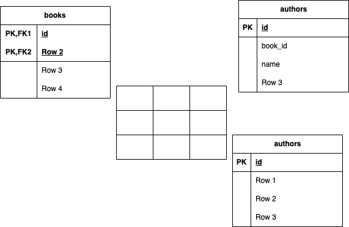

# フリマアプリ

## 環境構築

### Docker ビルド

```bash
git clone git@github.com:estra-inc/confirmation-test-contact-form.git
```

1. DockerDesktop アプリを立ち上げる
2. 以下のコマンドを実行して Docker をビルド
    ```bash
    docker-compose up -d --build
    ```

### Laravel 環境構築

1. コンテナに入る

    ```bash
    docker-compose exec php bash
    ```

2. 依存パッケージのインストール

    ```bash
    composer install
    ```

3. 環境変数の設定

    - 「.env.example」ファイルを 「.env」ファイルに命名を変更。または、新しく.env ファイルを作成
    - .env に以下の環境変数を追加
        ```
        DB_CONNECTION=mysql
        DB_HOST=mysql
        DB_PORT=3306
        DB_DATABASE=laravel_db
        DB_USERNAME=laravel_user
        DB_PASSWORD=laravel_pass
        ```

4. アプリケーションキーの作成

    ```bash
    php artisan key:generate
    ```

5. マイグレーションの実行

    ```bash
    php artisan migrate
    ```

6. シーディングの実行

    ```bash
    php artisan db:seed
    ```

7. シンボリックリンク作成
    ```bash
    php artisan storage:link
    ```

## 使用技術(実行環境)

-   PHP 7.4.9
-   Laravel 8.83.29
-   MySQL 8.0.26

## ER 図



## アクセス URL

-   開発環境：http://localhost/
-   phpMyAdmin：http://localhost:8080/
