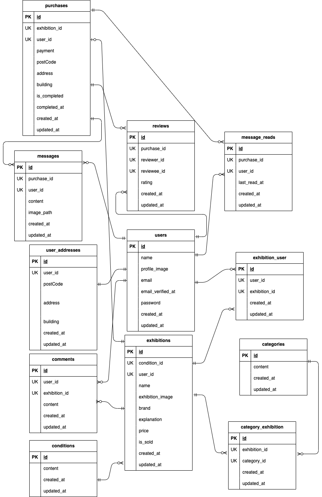

# フリマアプリ

## 環境構築

### Docker ビルド

```bash
git clone git@github.com:yoshihub/flema.git
```

1. DockerDesktop アプリを立ち上げる
2. 以下のコマンドを実行して Docker をビルド
   ```bash
   docker-compose up -d --build
   ```

### Laravel 環境構築

1. コンテナに入る

   ```bash
   docker-compose exec php bash
   ```

2. 依存パッケージのインストール

   ```bash
   composer install
   ```

3. Fortify のインストール

   ```bash
   composer require laravel/fortify
   ```

4. 環境変数の設定

   - 「.env.example」ファイルを 「.env」ファイルに命名を変更。または、新しく.env ファイルを作成
   - .env に以下の環境変数を追加
   - メール認証は mailtrap を使用

     ```
     DB_CONNECTION=mysql
     DB_HOST=mysql
     DB_PORT=3306
     DB_DATABASE=laravel_db
     DB_USERNAME=laravel_user
     DB_PASSWORD=laravel_pass

     MAIL_MAILER=smtp
     MAIL_HOST=sandbox.smtp.mailtrap.io
     MAIL_PORT=2525
     MAIL_USERNAME=mailtrapのユーザー名
     MAIL_PASSWORD=mailtrapのパスワード
     MAIL_ENCRYPTION=tls
     MAIL_FROM_ADDRESS=flema@example.com
     MAIL_FROM_NAME="${APP_NAME}"
     ```

5. アプリケーションキーの作成

   ```bash
   php artisan key:generate
   ```

6. マイグレーションの実行

   ```bash
   php artisan migrate
   ```

7. シーディングの実行

   ```bash
   php artisan db:seed
   ```

8. シンボリックリンク作成
   ```bash
   php artisan storage:link
   ```

## 使用技術(実行環境)

- PHP 7.4.9
- Laravel 8.83.29
- MySQL 8.0.26

## ER 図



## テーブル仕様

### users テーブル

| カラム名                  | 型              | PRIMARY KEY | UNIQUE KEY | NOT NULL | FOREIGN KEY |
| ------------------------- | --------------- | :---------: | :--------: | :------: | :---------: |
| id                        | bigint unsigned |      ◯      |            |    ◯     |             |
| name                      | varchar(255)    |             |            |    ◯     |             |
| profile_image             | varchar(255)    |             |            |          |             |
| email                     | varchar(255)    |             |     ◯      |    ◯     |             |
| email_verified_at         | timestamp       |             |            |          |             |
| password                  | varchar(255)    |             |            |    ◯     |             |
| created_at                | timestamp       |             |            |          |             |
| updated_at                | timestamp       |             |            |          |             |

### user_addresses テーブル

| カラム名   | 型              | PRIMARY KEY | UNIQUE KEY | NOT NULL | FOREIGN KEY |
| ---------- | --------------- | :---------: | :--------: | :------: | :---------- |
| id         | bigint unsigned |      ◯      |            |    ◯     |             |
| user_id    | bigint unsigned |             |            |    ◯     | users(id)   |
| postCode   | varchar(255)    |             |            |    ◯     |             |
| address    | varchar(255)    |             |            |    ◯     |             |
| building   | varchar(255)    |             |            |    ◯     |             |
| created_at | timestamp       |             |            |          |             |
| updated_at | timestamp       |             |            |          |             |

### conditions テーブル

| カラム名   | 型              | PRIMARY KEY | UNIQUE KEY | NOT NULL | FOREIGN KEY |
| ---------- | --------------- | :---------: | :--------: | :------: | :---------: |
| id         | bigint unsigned |      ◯      |            |    ◯     |             |
| content    | varchar(255)    |             |            |    ◯     |             |
| created_at | timestamp       |             |            |          |             |
| updated_at | timestamp       |             |            |          |             |

### categories テーブル

| カラム名   | 型              | PRIMARY KEY | UNIQUE KEY | NOT NULL | FOREIGN KEY |
| ---------- | --------------- | :---------: | :--------: | :------: | :---------: |
| id         | bigint unsigned |      ◯      |            |    ◯     |             |
| content    | varchar(255)    |             |            |    ◯     |             |
| created_at | timestamp       |             |            |          |             |
| updated_at | timestamp       |             |            |          |             |

### exhibitions テーブル

| カラム名         | 型              | PRIMARY KEY | UNIQUE KEY | NOT NULL | FOREIGN KEY    |
| ---------------- | --------------- | :---------: | :--------: | :------: | :------------- |
| id               | bigint unsigned |      ◯      |            |    ◯     |                |
| name             | varchar(255)    |             |            |    ◯     |                |
| exhibition_image | varchar(255)    |             |            |    ◯     |                |
| brand            | varchar(255)    |             |            |          |                |
| explanation      | text            |             |            |    ◯     |                |
| price            | int             |             |            |    ◯     |                |
| is_sold          | tinyint(1)      |             |            |    ◯     |                |
| condition_id     | bigint unsigned |             |            |    ◯     | conditions(id) |
| user_id          | bigint unsigned |             |            |    ◯     | users(id)      |
| created_at       | timestamp       |             |            |          |                |
| updated_at       | timestamp       |             |            |          |                |

### category_exhibition テーブル（中間）

| カラム名      | 型              | PRIMARY KEY | UNIQUE KEY | NOT NULL | FOREIGN KEY     |
| ------------- | --------------- | :---------: | :--------: | :------: | :-------------- |
| id            | bigint unsigned |      ◯      |            |    ◯     |                 |
| exhibition_id | bigint unsigned |             |            |    ◯     | exhibitions(id) |
| category_id   | bigint unsigned |             |            |    ◯     | categories(id)  |
| created_at    | timestamp       |             |            |          |                 |
| updated_at    | timestamp       |             |            |          |                 |

### exhibition_user テーブル（お気に入り）

| カラム名      | 型              | PRIMARY KEY |      UNIQUE KEY       | NOT NULL | FOREIGN KEY     |
| ------------- | --------------- | :---------: | :-------------------: | :------: | :-------------- |
| id            | bigint unsigned |      ◯      |                       |    ◯     |                 |
| user_id       | bigint unsigned |             |          ◯               |    ◯     | users(id)       |
| exhibition_id | bigint unsigned |             |          ◯              |    ◯     | exhibitions(id) |
| created_at    | timestamp       |             |                       |          |                 |
| updated_at    | timestamp       |             |                       |          |                 |
| UNIQUE      |                  |  | user_id,exhibition_id           |          |               |

### comments テーブル

| カラム名      | 型              | PRIMARY KEY | UNIQUE KEY | NOT NULL | FOREIGN KEY     |
| ------------- | --------------- | :---------: | :--------: | :------: | :-------------- |
| id            | bigint unsigned |      ◯      |            |    ◯     |                 |
| user_id       | bigint unsigned |             |            |    ◯     | users(id)       |
| exhibition_id | bigint unsigned |             |            |    ◯     | exhibitions(id) |
| content       | text            |             |            |    ◯     |                 |
| created_at    | timestamp       |             |            |          |                 |
| updated_at    | timestamp       |             |            |          |                 |

### purchases テーブル

| カラム名      | 型              | PRIMARY KEY | UNIQUE KEY | NOT NULL | FOREIGN KEY     |
| ------------- | --------------- | :---------: | :--------: | :------: | :-------------- |
| id            | bigint unsigned |      ◯      |            |    ◯     |                 |
| exhibition_id | bigint unsigned |             |            |    ◯     | exhibitions(id) |
| user_id       | bigint unsigned |             |            |    ◯     | users(id)       |
| payment       | varchar(255)    |             |            |    ◯     |                 |
| postCode      | varchar(255)    |             |            |    ◯     |                 |
| address       | varchar(255)    |             |            |    ◯     |                 |
| building      | varchar(255)    |             |            |    ◯     |                 |
| is_completed  | tinyint(1)      |             |            |    ◯     |                 |
| completed_at  | timestamp       |             |            |          |                 |
| created_at    | timestamp       |             |            |          |                 |
| updated_at    | timestamp       |             |            |          |                 |

### messages テーブル

| カラム名    | 型              | PRIMARY KEY | UNIQUE KEY | NOT NULL | FOREIGN KEY   |
| ----------- | --------------- | :---------: | :--------: | :------: | :------------ |
| id          | bigint unsigned |      ◯      |            |    ◯     |               |
| purchase_id | bigint unsigned |             |            |    ◯     | purchases(id) |
| user_id     | bigint unsigned |             |            |    ◯     | users(id)     |
| content     | varchar(255)    |             |            |    ◯     |               |
| image_path  | varchar(255)    |             |            |          |               |
| created_at  | timestamp       |             |            |          |               |
| updated_at  | timestamp       |             |            |          |               |
| deleted_at  | timestamp       |             |            |          |               |

### message_reads テーブル

| カラム名     | 型              |     PRIMARY KEY     | UNIQUE KEY | NOT NULL | FOREIGN KEY   |
| ------------ | --------------- | :-----------------: | :--------: | :------: | :------------ |
| id           | bigint unsigned |          ◯          |            |    ◯     |               |
| purchase_id  | bigint unsigned |                     |            |    ◯     | purchases(id) |
| user_id      | bigint unsigned |                     |            |    ◯     | users(id)     |
| last_read_at | timestamp       |                     |            |          |               |
| created_at   | timestamp       |                     |            |          |               |
| updated_at   | timestamp       |                     |            |          |               |
| UNIQUE       |                 | purchase_id,user_id |            |          |               |

### reviews テーブル

| カラム名    | 型               |       PRIMARY KEY       | UNIQUE KEY | NOT NULL | FOREIGN KEY   |
| ----------- | ---------------- | :---------------------: | :--------: | :------: | :------------ |
| id          | bigint unsigned  |            ◯            |            |    ◯     |               |
| purchase_id | bigint unsigned  |                         |            |    ◯     | purchases(id) |
| reviewer_id | bigint unsigned  |                         |            |    ◯     | users(id)     |
| reviewee_id | bigint unsigned  |                         |            |    ◯     | users(id)     |
| rating      | tinyint unsigned |                         |            |    ◯     |               |
| created_at  | timestamp        |                         |            |          |               |
| updated_at  | timestamp        |                         |            |          |               |
| UNIQUE      |                  | purchase_id,reviewer_id |            |          |               |
| INDEX       |                  |   reviewee_id,rating    |            |          |               |

## アクセス URL

- 開発環境：http://localhost/
- phpMyAdmin：http://localhost:8080/

## 認証済みユーザーアカウント

- CO01~CO05 の商品紐づけユーザー
- メールアドレス seller1@example.com
- パスワード password

- CO06~CO10 の商品紐づけユーザー
- メールアドレス seller2@example.com
- パスワード password

- 紐づけなしユーザー
- メールアドレス standalone@example.com
- パスワード password
